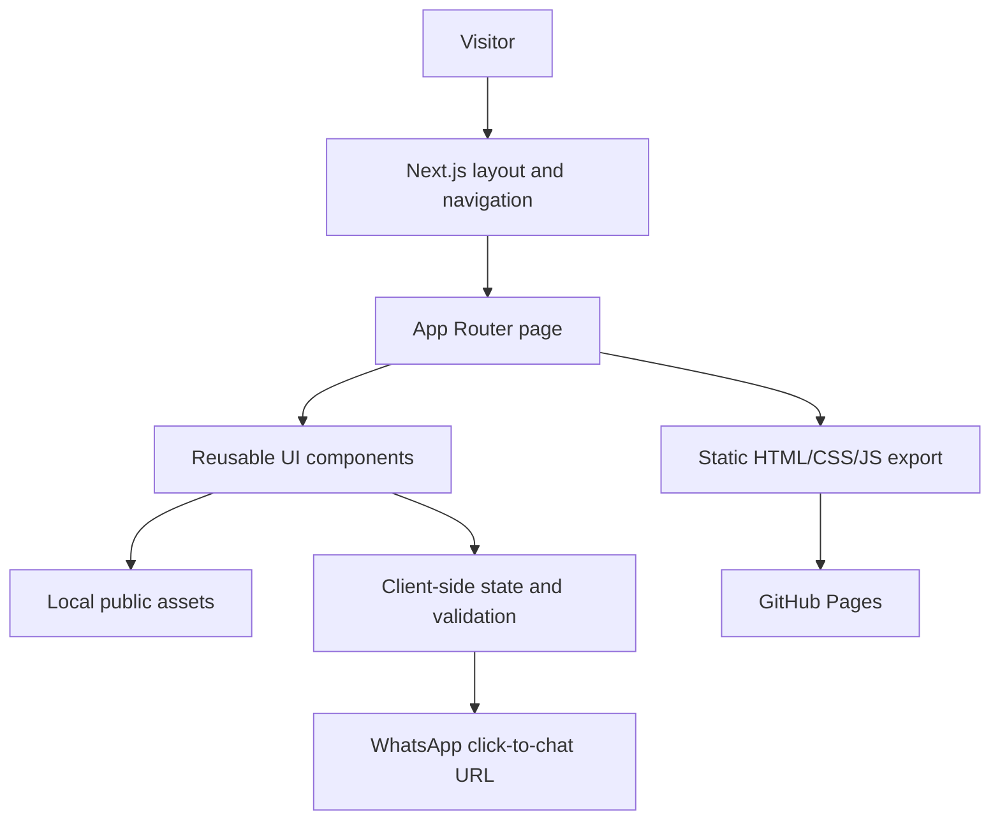

# Architecture

## Architecture style

The project uses a static-exported Next.js App Router architecture. Server Components render page content at build time. Small client components provide browser-only state and interaction, including carousels, back-to-top visibility, contact validation, career modals, and WhatsApp handoff.



## Frontend

- `src/app/layout.tsx` defines the global shell: `Header`, page content, `Footer`, and `BackToTop`.
- Route pages under `src/app/(site)/` provide the major screens.
- `src/components/layout/` contains global header and footer.
- `src/components/ui/` contains reusable buttons, section navigation, image, carousel, and page presentation components.
- `src/config/navigation.ts` defines top-level navigation and in-page child anchors.
- `src/lib/` contains asset, logo, SEO, and WhatsApp helpers.

## Backend and data layer

No backend or database is present. Content is defined in TypeScript modules and page components. Static assets are served from `public/assets/`.

## External services

The only user-triggered external integration is WhatsApp click-to-chat using `https://wa.me/<number>?text=<encoded message>`. No API credentials or server request are used.

## State management

There is no global state library. Local React state is used for carousel positions, back-to-top visibility, form values/errors, modal state, and post-handoff status.

## Routing and data flow

```mermaid
sequenceDiagram
  participant V as Visitor
  participant R as Next route
  participant C as Client component
  participant WA as WhatsApp
  V->>R: Open page
  R-->>V: Static page and local assets
  V->>C: Fill and submit enquiry
  C->>C: Validate required fields
  alt Invalid
    C-->>V: Inline validation errors; preserve fields
  else Valid
    C->>C: Build and encode message
    C->>WA: Open click-to-chat URL
    C-->>V: Show prepared-in-WhatsApp status
  end
```

## Build and deployment

`next.config.ts` sets `output: "export"`, trailing slashes, optional base path support, and unoptimized images. `npm run build` produces `out/`. GitHub Actions uploads `out/` to GitHub Pages on pushes to `main`.

## Known architecture concern

The current `canonicalRoutes` list in `src/lib/seo.ts` still contains legacy detail paths removed from the App Router. This is documented but not changed as part of the documentation-only task.
